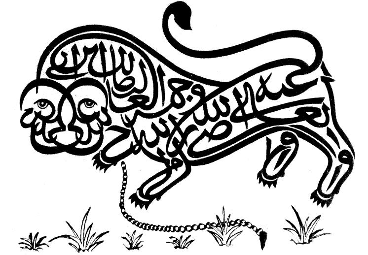

> “People are of two kinds: either your brothers in faith or your equals in humanity.”  
> —  Ali ibn Abi Talib, 4th and last of the Rashidun Caliphs, whose vision of justice and equality faded with the divisions that followed.

I’ve been reading *Ali: Elixir of Love*, and this line struck me with its timeless moral clarity. It captures a universality that bridges faith and human dignity — something I think the modern world desperately needs to rediscover (more reflections coming soon.)

Overall, I am througly enjoying the book and highly recomend it to anyone interested in history, the middle east, or a desire to understand the Islamic world better. 

[Buy *Ali: Elixir of Love* on Amazon](https://amzn.to/44mkrPb)
