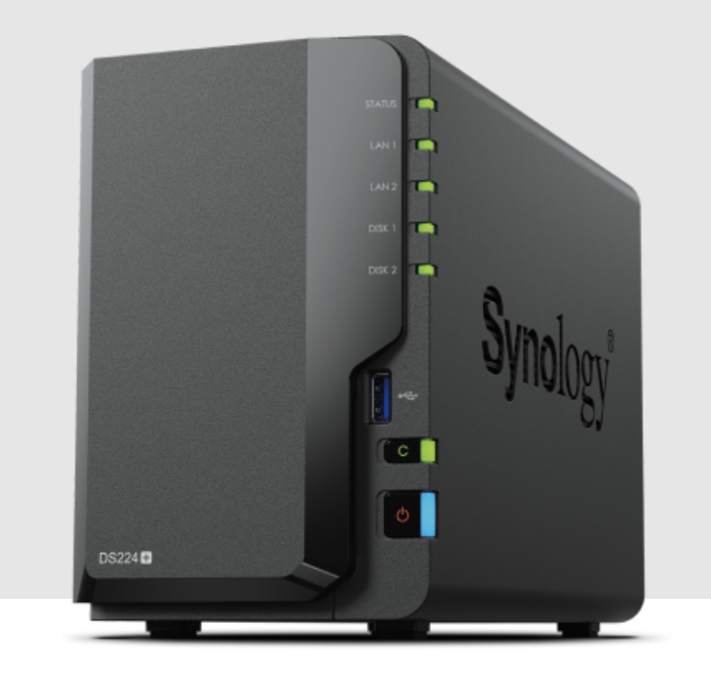
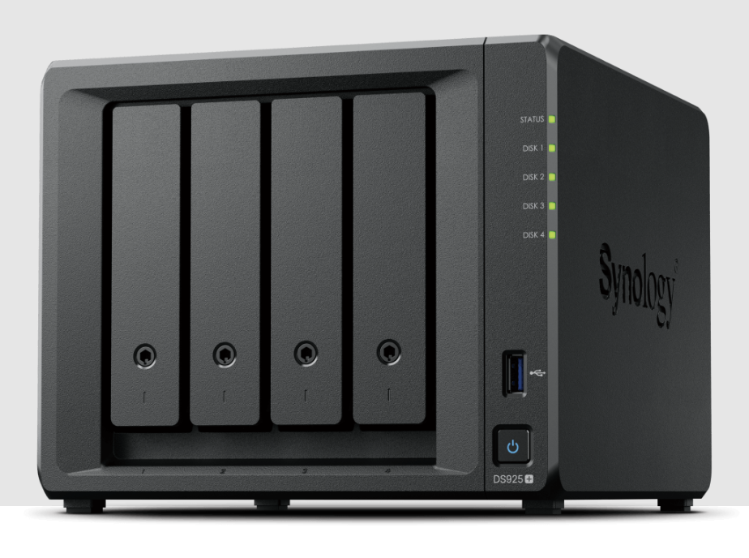
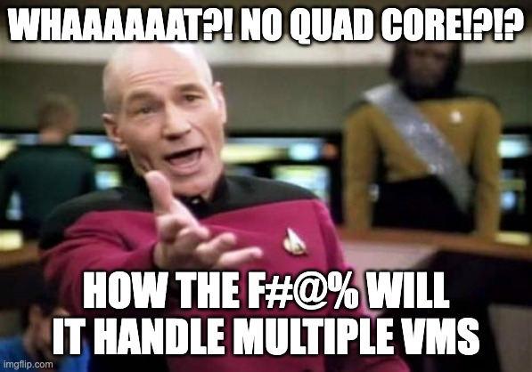
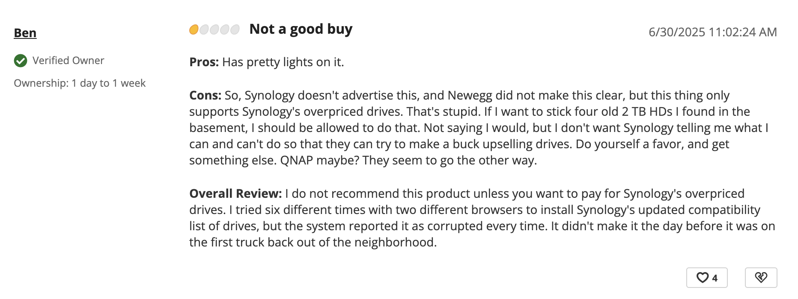
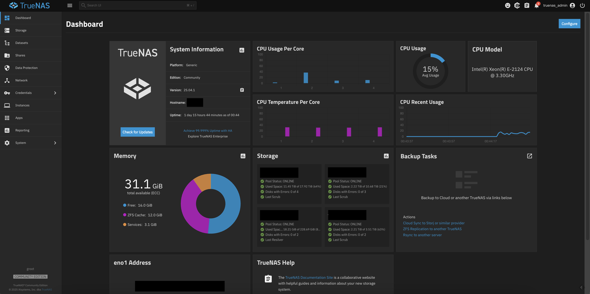
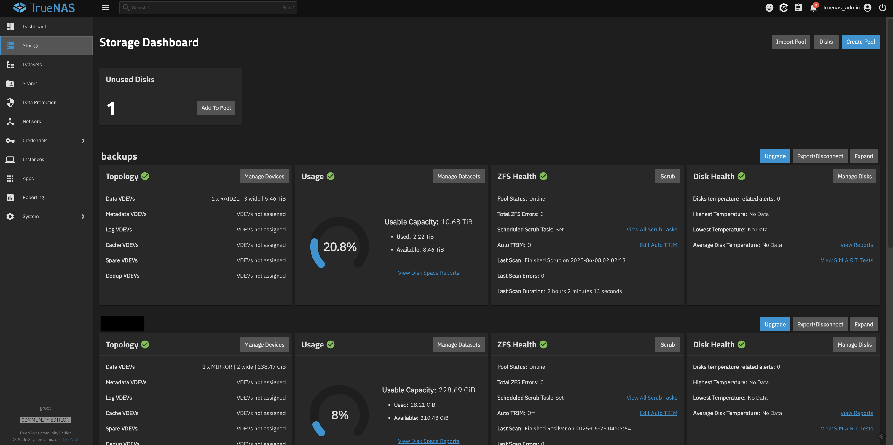
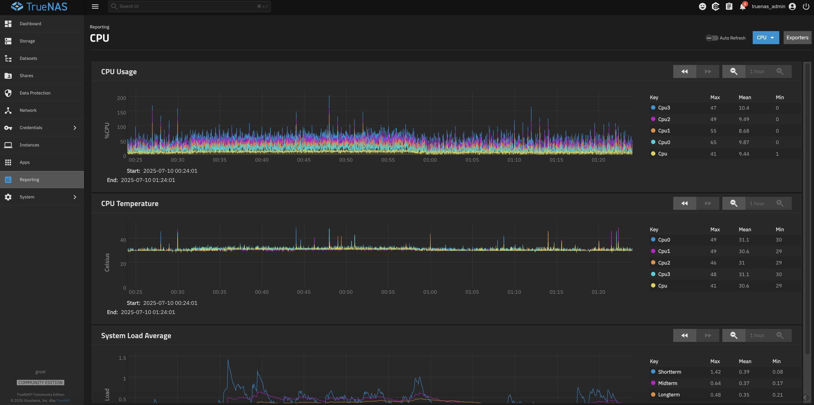

I’ve always been a tinkerer—especially when it comes to computers. I vividly remember the first PC my family owned in 1995. I’d tag along with my dad to brick-and-mortar computer stores during the golden age of the PC, watching him and his friend spend hours building and configuring that machine. That moment planted the seed.

That, and *Prince of Persia*.  

As I got older, my passion only deepened. I saved my allowance and birthday money for years before finally building my first PC as a teenager: a humble Pentium 4 (non-HT) based Celeron with 512 MB of RAM, an 80 GB hard drive, and an ATI Radeon 9200. Total cost? Just under $700. Even back then, the components I picked outperformed the generic builds sold by Dell, HP, and Compaq.

So it’s no surprise I took the same DIY approach when it came to NAS units.

---

## The Problem With Off-the-Shelf NAS

Browse any Synology or QNAP catalog, and you’ll notice a pattern: underpowered specs at premium prices. For example:

### [Synology DS224+](https://www.newegg.com/synology-ds224-2-bay-intel-celeron-j4125-2-0-ghz-processor-diskless-system/p/N82E16822108840?Item=N82E16822108840)

- **CPU**: Intel Celeron J4125 (Quad-core 2.0 GHz)  
- **RAM**: 2 GB DDR4 non-ECC (expandable to 6 GB)  
- **Drive Bays**: 2 x SATA  
- **Network**: 2 x 1 GbE  
- **Power**: 14.69W  
- **Price**: ~$300  

### [Synology DS925+](https://www.newegg.com/synology-ds925-4-bay-4gb-ddr4-ecc-sodimm-intel-celeron-j4125-processor-diskless-system/p/N82E16822108847?Item=N82E16822108847)

- **CPU**: AMD Ryzen V1500 (2-core, 2.2 GHz)  
- **RAM**: 4 GB ECC (expandable to 32 GB)  
- **Drive Bays**: 4 x SATA  
- **Network**: 2 x 1 GbE, 1 x PCIe Gen3 x2  
- **Power**: 38W  
- **Price**: ~$650  

Yes, they can serve files across a network—but so can an aging desktop you’ve got collecting dust. You're essentially paying a premium for low-end hardware, limited RAM, and very little room to grow.

---

## The Synology Lock-In Problem

To make matters worse, Synology recently locked their Plus-series NAS units to **only** use Synology-branded hard drives. This means you can't install third-party drives, even if they’re perfectly functional.

👉 [Read more](https://www.techpowerup.com/335824/synology-forcing-owners-of-its-plus-series-nas-appliances-to-use-own-brand-hard-drives)

Unsurprisingly, this decision triggered major backlash. As of this writing, Synology is the only major vendor enforcing this kind of lock-in. If you're someone who values flexibility, this alone should be a red flag.

<figure style="max-width: 300px; margin: 0;">
  
  <figcaption style="font-size: 0.9em; color: #666; margin-top: 4px;">
    A unhappy customer on Newegg
  </figcaption>
</figure>

---

## Why I Built My Own

When I looked into NAS options in 2016, Synology seemed like the natural choice. But their specs felt too limiting—and their ecosystem increasingly closed. I knew I could build something better, cheaper, and far more customizable.

So I built my own.

That gave me full control over every component: CPU, RAM, storage, cooling, networking—even the case aesthetics. I could expand as needed, repurpose parts over time, and avoid paying for unnecessary limitations.

And in most cases, I still spent *less* than the cost of a comparable Synology box.

---

## Hardware

### Build From Scratch or Repurpose?

Should you start from scratch or reuse what you’ve got?

It depends on your needs.

If you already have a gaming PC or an older workstation and aren’t concerned about power draw, repurposing is often the best—and most sustainable—option. Indeed, if you have spare HDs lying around, why not repurpose them? (UnRaid is better here, but we'll review that later)

But if you're aiming for 24/7 uptime and energy efficiency, you'll want to be more selective. Intel’s 10th-gen and newer chips offer great performance-per-watt for home servers. Server-grade CPUs are even better under load, but they’re not essential unless you’re running heavier workloads like real-time transcoding or multiple VMs.

### Alternative Route: Used Workstations as NAS Unit

Modern computers—especially since Intel’s 6th-generation Skylake architecture—have become increasingly capable of handling virtualization. As a result, many homelab enthusiasts are turning to refurbished business workstations and servers to power their NAS setups.

If you don’t have a spare PC and don’t want to build a system from scratch, the general community recommendation is to start with a used business-class workstation or server. These systems can typically be found for anywhere from $100 to $700, depending on age, specs, and condition.

Recommended brands and models:
- **Lenovo**
  - ThinkCentre  
  - ThinkStation  
  - ThinkSystem (replaces ThinkServer)
  - ThinkServer (discontinued but widely available on used market)

- **Dell**
  - OptiPlex  
  - Precision  
  - Edge  

- **HP**
  - Z-Series Workstations  
  - Enterprise

> ⚠️ **Power Supply Compatibility**
>
> A few caveats—both Lenovo and Dell often use **proprietary power supplies** with **non-standard motherboard connectors** in their business desktops and workstations. This means you're generally limited to their OEM PSU replacements if yours fails.
>
> While there *are* adapters and DIY workarounds available to use standard ATX power supplies, I haven’t personally tested them, so proceed with caution if you go that route.

When shopping, keep an eye on upgrade potential: available drive bays, PCIe slots, and memory expansion (i.e., number of DIMM slots used vs. available). While many workstations ship with non-ECC RAM, server-grade models often come with ECC memory pre-installed—offering great value considering how expensive ECC modules can be when bought separately.

Looking back, I wish I had considered this route before building my second NAS. It would’ve saved both time and money.

### Case
Some—like my father—might disagree, but I believe the **chassis ties everything together**. It’s not just a box for your parts—it defines airflow, noise, expandability, and even aesthetics. If your NAS will live in a visible space (like a home office or living room), it’s worth choosing a case that looks great and supports your future needs.

Look for cases with:

- **Good airflow**
- **Quiet operation**
- **6+ hard drive bays** (if planning for expansion)
- **Support for standard ATX or mATX boards**

Here are a few solid options at different sizes and budgets:

- 🧊 **[Rosewill Thor V2](https://amzn.to/44Cxvib)** (Full ATX Tower, 11 HDDs, ~$200)  
- 🧱 **[Fractal Design Node 804](https://amzn.to/44FbsY6)** (mATX Cube, 8 HDDs, ~$100)  
- 📦 **[Fractal Design Node 203](https://amzn.to/4nE2LpK)** (ITX Cube, 6 HDDs, ???)  
- 🎩 **[Fractal Define 7](https://amzn.to/45Xc79K)** (Mid ATX Tower, silent, ~$200)  
- 🔧 **[DarkFlash Classico](https://amzn.to/44nrW8A)** (Mid ATX Tower, 10 HDDs, ~$100)  
- 🪟 **[Jonsbo N3 Mini](https://amzn.to/46wCtj1)** (ITX Cube, 8+ HDDs, ~$150)

If you plan to hide your NAS in a closet or rack, **aesthetics matter less—but cooling still does**. In that case, skip the fancy chassis and repurpose an old desktop or pick up a used workstation or server chassis like the ones mentioned earlier. You'll stretch your budget further without sacrificing performance.

### Cooling & Filters

This is one of my favorite topics—and something I’ve obsessed over since my teenage years, when my ridiculously hot Pentium 4 with Hyper-Threading doubled as a space heater. Lesson learned: heat kills. And heat + dust? That’s a surefire way to murder your components.

Whether you're buying, building, or repurposing a system, don't overlook cooling. A few minutes of planning here can easily add years to your NAS’s lifespan.

#### Airflow Basics
At a minimum, you’ll want at least one exhaust (outtake) fan to expel hot air from the case. Pair it with one or more intake fans to create steady airflow across your drives, CPU, and motherboard. A setup with positive air pressure (more intake than exhaust) is ideal—it not only keeps components cool but also helps minimize dust buildup when combined with filters.

When it comes to cooling gear, I’ve always been a fan of Zalman for their solid price-to-performance ratio. But if you're after premium quality and near-silent operation, Noctua and be quiet! Dark Rock are standout choices—they make excellent coolers and fans.

#### Skip the Water
Water cooling in a NAS is pure overkill. It introduces unnecessary complexity and risk—especially when you’re storing terabytes of irreplaceable data. Stick with air. It's quieter, safer, cheaper, and easier to maintain.

#### Dust Protection
Dust is the silent killer of airflow and thermal performance. To prevent it from accumulating, use filters—especially on intake fans. Higher-end cases typically include them by default, but if yours doesn’t, you can grab inexpensive magnetic or stick-on options like these.

Good airflow + dust prevention = long-lasting hardware and peace of mind.

### CPU

For simple file storage, a **dual-core CPU** may be enough. But if you plan to run apps, containers, or virtual machines, you’ll want at least a **quad-core processor**—and ideally one with **hyperthreading** for smoother multitasking.

#### Recommended CPUs

- **Intel**  
  - *Mainstream picks*: 6th Gen (Skylake) i5/i7 and newer  
  - *High-end*: 11th gen (Rocket Lake) i5/i7 and newer
  - *ECC support*: Starting with the 11th and 12th generations, some i5/i7 CPUs offer ECC support **when paired with the right motherboard**—a worthwhile upgrade if data integrity is a priority.

- **AMD**  
  - *Budget*: Ryzen 3000 series  
  - *High-end*: Ryzen 5000 series (many SKUs now support ECC as well)

#### On Overkill

High-end CPUs like **AMD Threadripper** are exciting, but mostly overkill for NAS tasks. Unless you're running a heavy-duty setup with multiple VMs or containers, you’re better off spending your money elsewhere.

#### Server-Grade CPUs

The case for using **Xeon processors** has weakened in recent years. While they once stood out for power efficiency and ECC memory support, modern Intel (11th gen and newer) and AMD (Ryzen 5000 series and up) consumer CPUs now offer comparable ECC compatibility—often with better performance-per-dollar and broader platform flexibility.

Unless you can get a Xeon system cheaply or need specific features from a server-grade motherboard (like IPMI or high PCIe lane count), **newer consumer CPUs often offer better performance-per-watt** and broader compatibility.

### Motherboard
Not much of an opinion on this besides avoiding non-name brands (on Alibaba). Personally, I've never had an issue with Gigabyte. Ever. I try to use Gigabyte in every build unless something is drastaically cheaper or better. That being said, my recomendations in order:
1. Gigabyte  
2. ASRock  
3. MSI  
4. Asus

#### Server vs. Consumer Motherboards

Server-grade motherboards are powerful, but they come at a premium. The key advantages they offer over consumer boards include **more PCIe lanes**, **ECC memory support**, and server-centric features like **IPMI** (remote management). Whether these features are worth the extra cost depends entirely on your use case.

For example, those additional PCIe lanes become invaluable if you ever want to:

- Add a **dedicated SATA controller** to expand your drive count
- Install a **2.5G or 10G network card** for faster LAN performance
- Use a **dedicated GPU** for Plex hardware transcoding
- Mount a **PCIe-to-M.2 adapter** to add more SSDs

A typical consumer board may limit how many of these you can install simultaneously, due to restricted PCIe bandwidth or slot availability.

Personally, I use a server-grade motherboard in my main NAS, and I absolutely appreciate **IPMI**. Being able to access the BIOS or power cycle the machine remotely—without ever plugging in a monitor—is a lifesaver when troubleshooting.

That said, if you don’t need remote management or multiple expansion cards, a good consumer motherboard will do just fine—and likely save you $100–$200 or more.

### Memory
When running TrueNAS, RAM is king. The more memory you have, the better—especially because the ZFS file system is memory-hungry and uses available RAM for caching and performance optimization.

While RAM speed has minimal impact on ZFS, capacity is critical. For a basic file server, you might get by with 8 GB, but if you plan to run virtual machines, apps, or heavier services, you’ll want at least 16 GB.

Personally, I wouldn’t go below 16 GB for any modern NAS. The sweet spot today is around 32–64 GB. Anything beyond 128 GB is probably overkill for most home users and not the best use of budget unless you have a very specific workload in mind.

#### ECC Memory

ECC memory isn’t mandatory—but it’s good to have. It helps prevent bit errors and corruption during file transfers. That said, TrueNAS is already resilient, and for most users, proper backups and a redundant ZFS setup are more important than ECC.

It’s worth mentioning that even the developers of TrueNAS recommend prioritizing redundancy through disk parity over aggressively investing in ECC memory. Disk-level redundancy protects against a much broader range of failure scenarios, while ECC memory guards against rare, one-in-a-million bit flips. If you're running a business or handling mission-critical data, ECC is worth considering. But for most home users, the added cost isn't justified—you’re better off allocating that budget toward better drives or backups.

Skipping ECC memory will likely save you $100 or more—savings that can be better spent on extra storage, more RAM capacity, or other upgrades that deliver a bigger impact for most home users. 

### Hard Drives

If you already have hard drives on hand, that’s a great starting point—especially if you’re going with Unraid, which handles mixed drive sizes and brands exceptionally well.

As a general rule, you’ll want at least two hard drives with several terabytes of capacity. With two drives, you can designate one as a parity disk for basic data protection.

If you're using ZFS (as in TrueNAS), the recommendation is three or more drives, which unlocks a range of RAID-like configurations (RAIDZ1, RAIDZ2, mirrors, etc.). These setups offer better redundancy and fault tolerance, allowing your system to survive multiple drive failures—depending on the layout.

The more drives you have in a particular pool, the more flexible and resilient your storage pool becomes.

#### NAS Hard Drives
If you're building a system from scratch, it’s generally recommended to invest in NAS-specific hard drives, such as Seagate IronWolf or Western Digital Red.

These drives are designed for 24/7 operation, offer better vibration resistance, and often include firmware optimizations for RAID environments. They also tend to spin at lower RPMs (typically 5,400–5,900), which reduces power consumption and heat—ideal for always-on storage setups.

---

## Software: Unraid vs. TrueNAS vs. the Rest

There are plenty of NAS operating systems—both open-source and commercial—but the two most talked about are [**TrueNAS**](https://www.truenas.com/) and [**Unraid**](https://unraid.net/).

**Unraid** is beginner-friendly and strikes an excellent balance between simplicity and power. While it doesn’t support ZFS, it does shine in virtualization, GPU passthrough, and ease of use. Its app ecosystem is intuitive and arguably unmatched in simplicity—it just works. Combined with a clean, polished UI, Unraid is often easier to manage than TrueNAS or even Proxmox for casual users.

The main tradeoff? Unraid isn’t open source and requires a paid license, starting at around $50 for a lifetime key. That said, considering its capabilities, the cost is more than reasonable.

By contrast, **TrueNAS** is a more advanced, NAS-centric operating system designed for reliability, scalability, and performance. It’s built around ZFS but also supports other file systems. TrueNAS SCALE, the newer Linux-based variant, includes modern virtualization features and Docker support. It has a growing catalog of apps, though setup and configuration may require more technical familiarity—making it better suited for intermediate to advanced users.

<figure style="max-width: 300px; margin: 0;">
  
  <figcaption style="font-size: 0.9em; color: #666; margin-top: 4px;">
    The beautiful TrueNAS dashboard
  </figcaption>
</figure>

If I were starting today—especially as a newcomer—I’d probably lean toward Unraid. It's particularly appealing if you’ve got a hodgepodge of old hard drives lying around and want to pool them together without worrying about matching sizes. Unlike TrueNAS, which is built around ZFS and expects uniform drive sizes for optimal performance, Unraid is designed from the ground up to support mismatched disks.

While Unraid doesn’t use ZFS by default, you can create and mount ZFS pools on an Unraid server. That said, doing so isn’t typically recommended unless you have a specific use case. Unraid’s architecture is fundamentally different, and trying to retrofit ZFS into its workflow may result in unnecessary complexity or trade-offs.

#### A Note on Redundancy Philosophies
Though both are highly capable, TrueNAS and Unraid approach redundancy very differently:

TrueNAS relies on ZFS and its native software RAID configurations to ensure data integrity and redundancy. This requires you to use drives of the same size (or else excess capacity is wasted to match the smallest disk).

Unraid, by contrast, takes a simpler but still robust approach: you designate a single disk (usually the largest) as a parity drive, and the remaining disks store actual data. This allows you to mix and match drive sizes while still maintaining fault tolerance—at a lower upfront cost.

In short, Unraid is a better fit for those starting out with varied hardware and wanting flexibility. TrueNAS offers more power and data integrity guarantees, but expects more structure and planning up front.

---

## A Quick Word on TrueNAS

Back in 2016, TrueNAS was known as FreeNAS. Since then, the parent company behind the project, iXsystems split the project into:

- **TrueNAS CORE** – based on FreeBSD with Jails for virtualization  
- **TrueNAS SCALE** – a newer Linux-based version using Docker (and previously Kubernetes)

[SCALE](https://www.truenas.com/download-truenas-community-edition/) is now the future. It’s open source, supports a robust app ecosystem, offers full ZFS support, and is purpose-built for NAS-first workloads.

If you're technically inclined and want the most powerful open-source NAS platform available—TrueNAS SCALE is hard to beat. Its also quite beautiful to look at and use. 

<figure style="max-width: 300px; margin: 0;">
  
  <figcaption style="font-size: 0.9em; color: #666; margin-top: 4px;">
    TrueNAS storage dashboard
  </figcaption>
</figure>

<figure style="max-width: 300px; margin: 0;">
  
  <figcaption style="font-size: 0.9em; color: #666; margin-top: 4px;">
    TrueNAS metrics and reporting dashboard
  </figcaption>
</figure>

---

## My TrueNAS Builds  
> 📌 *Note: To keep the comparison fair, I’m not including the cost of hard drives since most off-the-shelf NAS units are sold diskless.*

### **Build 2016 — My First NAS**

I could’ve reused an older computer, but I wanted a system I could leave running 24/7—quiet, low-power, and purpose-built. I went with the Athlon X4 5350 since it checked those boxes and was relatively cheap when bundled with an MSI motherboard at Fry’s Electronics for around $100—maybe even less, I honestly don’t remember. I did reuse parts where I could—PSU, RAM, fans, etc.

**Specs:**

- **Case**: Fractal Design Node 304  
- **PSU**: Antec EarthWatts 380W Bronze  
- **CPU**: AMD Athlon X4 5350 2.0 GHz Quad-Core  
- **Motherboard**: MSI AM1I (ITX, no ECC support)  
- **RAM**: 8 GB DDR3-1600 (2 DIMMs)  
- **Storage**: 6 x 3.5" HDDs  
- **Cooling**:  
  - Intake: 2 x 92mm  
  - Exhaust: 1 x 140mm  
- **Cost**: ~$350  

**Applications:**  
Plex, Transmission

**Notes:**  
The Athlon 5350 was a popular HTPC CPU back in the day ([source](https://www.reddit.com/r/buildapc/comments/2w7kj6/owners_of_am1_cpus_amd_5350_etc_how_satisfied_are/)). It handled typical NAS tasks just fine. Intel didn’t have much to offer in this segment besides Celeron and Pentium chips, whose motherboards often demanded a premium.

By 2018–2019, however, transcoding 1080p media started pushing its limits. Originally this box wasn’t meant for Plex, but it adapted well as my needs grew.

Eventually, the time came to upgrade from FreeNAS to TrueNAS CORE, which required some hardware changes. I ended up retiring the old CPU and motherboard, upgraded the unit to a Xeon E3-1260L (low-power) with an appropriate board and 16 GB ECC RAM, and handed it off to a cousin also pursuing Computer Engineering for undergrad.

---

### **Build 2020 — My Current NAS**

This was mostly built brand new, with only the SSD holding the OS carried over from the previous build.

**Specs:**

- **Case**: Fractal Design Node  
- **PSU**: Fractal Ion+ 560W Platinum  
- **CPU**: Intel Xeon E-2124 (3.3 GHz Quad-Core)  
- **Motherboard**: ASRock E3C246D4U (Micro ATX, ECC support)  
- **RAM**: 32 GB DDR4 ECC (4 DIMMs)  
- **Storage**:  
  - 8 x 3.5" HDDs  
  - 4 x 2.5" SSDs  
  - 512 GB Sabrent Rocket NVMe (L2ARC cache)  
- **HBA**: Dell LSI 9300-8i  
- **Cooling**:  
  - Intake: 4 x 120mm  
  - Exhaust: 3 x 120mm, 3 x 140mm  
- **Approx Cost**: ~$900  
  > *Should’ve been ~$700, but pandemic-era shortages inflated prices.*

**Applications:**  
Plex, Transmission, UrBackup, FileBrowser, ClamAV, OpenSpeedTest, and more

**Notes:**  
I chose the Xeon E-2124 for its power efficiency and low TDP. Looking back, I might’ve opted for something with more cores and threads.

CPU usage once spiked to 80% while attempting to transcode a 4K stream—understandable since there’s no GPU acceleration. Under normal conditions, the system idles under 20%, even with multiple apps and VMs running.

Memory usage typically uses around 4 GB for apps, 12–16 GB for ZFS, with the remainder free. Even under load, temperatures have stayed below 60°C.

---

## Software Upgrades with TrueNAS

I’ve upgraded my TrueNAS units a few times. The first was during the pandemic in 2020 (FreeNAS → TrueNAS CORE). My most recent upgrade was driven by dependency issues with packages needed to run VMs (TrueNAS Core -> TrueNAS Scale)

Regardless, the upgrade path was seamless. Following community recommendations, I did a fresh install and simply imported my pools and datasets. Nothing was lost.

There were a few hiccups with file permissions, but TrueNAS resolved them easily using its built-in permissions system. Overall, I’ve been highly satisfied with its reliability, performance, and ease of use.

---

## Future Plans

As I’ve mentioned, I’m extremely satisfied with my current NAS. It’s more powerful, more flexible, and far more future-proof than any off-the-shelf solution from Synology or QNAP.

That said, if I were starting fresh today—especially with a mixed bag of hardware—I’d likely go with Unraid. Its ease of use, flexibility with mismatched drives, and solid community support make it an appealing choice. It’s something I plan to explore soon, more as a fun side project than a necessity.

Rather than invest in new components, I’ll be reusing parts I already have—especially a stack of spare hard drives—to see how Unraid handles real-world workloads.

---

### Proposed Build

This new build will be a frugal experiment, built mostly from salvaged parts and nostalgia.

**Specs:**

- **Case**: Thermaltake Armor (donated)  
> This case has a story. It belonged to my friend [Max R](https://www.linkedin.com/in/maksimr/)—his very first PC build back in high school, which I helped him assemble. He picked this case specifically to house what was, at the time, an absurdly ambitious build: a system centered around the world’s first consumer dual-GPU card.
>
> Back then, SLI (dual graphics cards) was the hot new trend—even though almost nothing outside of CAD or SolidWorks really benefited from it. I begged Max not to buy the NVIDIA GeForce 9800 GX2—a monstrously overpriced, power-hungry GPU that our mutual friend Brian (a well-meaning but hopeless tech hype man) insisted was the future.
>
> It made zero sense from a price-to-performance standpoint. But Max went for it anyway. He was working at a bowling alley and had the teenage equivalent of “f*** you” money.
>
> Years later, before he moved to NYC, I asked if I could hang onto the case. He happily obliged. They don’t make cases like this anymore—massive, heavy, and built like a tank. Thank you Max. 

- **PSU**: EVGA Supernova 750W Bronze (spare)  
- **CPU**: TBD  
- **Motherboard**: TBD  
- **RAM**: TBD  
- **Storage**:  
  - 9 x 3.5" HDDs (varied makes and models)  
- **HBA**: Supermicro LSI 9300-8i  
- **Cooling**:  
  - **Intake**: TBD (this case oddly lacks proper front intake mounts, perhps a [HD cooling box](https://www.newegg.com/rosewill-rsv-sata-cage-34-hard-disk-drive-cage/p/N82E16816132037?item=N82E16816132037&nm_mc=knc-googleadwords&cm_mmc=knc-googleadwords-_-server+-+accessories-_-rosewill-_-16132037&utm_source=google&utm_medium=organic+shopping&utm_campaign=knc-googleadwords-_-server+-+accessories-_-rosewill-_-16132037&source=region&gPromoCode=FTTEU7538&gQT=0) that has an intake fan will help here) 
  - **Exhaust**: 1 x 120mm, 1 x 80mm  

**Target Cost**: Under $500

## Final Thoughts

If you care about performance, flexibility, or value for money, building your own NAS is a no-brainer. You’ll get full control over your hardware, expandability for years to come, and the satisfaction of crafting something truly yours.

Bonus: you'll learn a ton along the way—and probably have some fun doing it.
