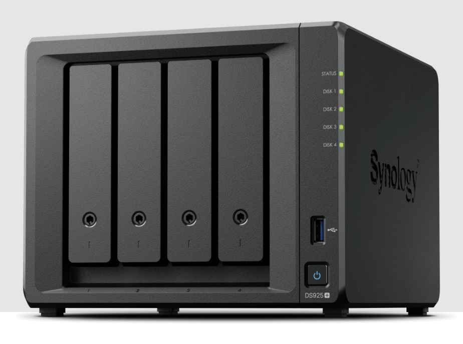
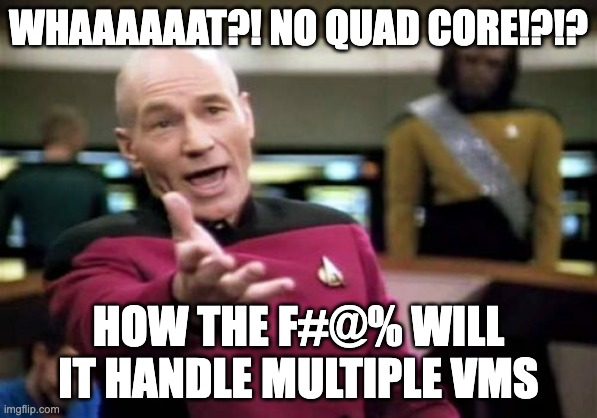
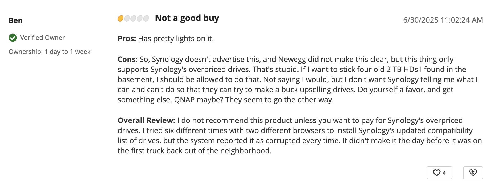

## Introduction

I’ve always been a tinkerer—especially when it comes to computers. I vividly remember the first PC my family owned in 1995. I’d tag along with my dad to brick-and-mortar computer stores during the golden age of the PC, watching him and his friend spend hours building and configuring that machine. That moment planted the seed.

That, and *Prince of Persia*.  

As I got older, my passion only deepened. I saved my allowance and birthday money for years before finally building my first PC as a teenager: a humble Pentium 4 (non-HT) based Celeron with 512 MB of RAM, an 80 GB hard drive, and an ATI Radeon 9200. Total cost? Just under $700. Even back then, the components I picked outperformed the generic builds sold by Dell, HP, and Compaq.

So it’s no surprise I took the same DIY approach when it came to NAS units.

---

## Why I Built My Own

When I looked into NAS options in 2016, Synology seemed like the natural choice. But their specs felt too limiting—and their ecosystem increasingly closed. I knew I could build something better, cheaper, and far more customizable.

That gave me full control over every component: CPU, RAM, storage, cooling, networking—even the case aesthetics. I could expand as needed, repurpose parts over time, and avoid paying for unnecessary limitations.

And in most cases, I still spent *less* than the cost of a comparable Synology box.

---

## The Problem With Off-the-Shelf NAS

Browse any Synology or QNAP catalog, and you’ll notice a pattern: underpowered specs at premium prices. For example:

### [Synology DS224+](https://www.newegg.com/synology-ds224-2-bay-intel-celeron-j4125-2-0-ghz-processor-diskless-system/p/N82E16822108840?Item=N82E16822108840)

- **CPU**: Intel Celeron J4125 (Quad-core 2.0 GHz)  
- **RAM**: 2 GB DDR4 non-ECC (expandable to 6 GB)  
- **Drive Bays**: 2 x SATA  
- **Network**: 2 x 1 GbE  
- **Power**: 14.69W  
- **Price**: ~$300  

### [Synology DS925+](https://www.newegg.com/synology-ds925-4-bay-4gb-ddr4-ecc-sodimm-intel-celeron-j4125-processor-diskless-system/p/N82E16822108847?Item=N82E16822108847)

- **CPU**: AMD Ryzen V1500 (2-core, 2.2 GHz)  
- **RAM**: 4 GB ECC (expandable to 32 GB)  
- **Drive Bays**: 4 x SATA  
- **Network**: 2 x 1 GbE, 1 x PCIe Gen3 x2  
- **Power**: 38W  
- **Price**: ~$650  

Yes, they can serve files across a network—but so can an aging desktop you’ve got collecting dust. You're essentially paying a premium for low-end hardware, limited RAM, and very little room to grow.

---

## The Synology Lock-In Problem

To make matters worse, Synology recently locked their Plus-series NAS units to **only** use Synology-branded hard drives. This means you can't install third-party drives, even if they’re perfectly functional.

👉 [Read more](https://www.techpowerup.com/335824/synology-forcing-owners-of-its-plus-series-nas-appliances-to-use-own-brand-hard-drives)

Unsurprisingly, this decision triggered major backlash. As of this writing, Synology is the only major vendor enforcing this kind of lock-in. If you're someone who values flexibility, this alone should be a red flag.

<figure style="max-width: 300px; margin: 0;">
  
  <figcaption style="font-size: 0.9em; color: #666; margin-top: 4px;">
    A unhappy customer on Newegg
  </figcaption>
</figure>

---

## Hardware Overview

### Build From Scratch or Repurpose?

If you already have a gaming PC or an older workstation and aren’t concerned about power draw, repurposing is often the best—and most sustainable—option.

But if you're aiming for 24/7 uptime and energy efficiency, you'll want to be more selective. Intel’s 10th-gen and newer chips offer great performance-per-watt. Server-grade CPUs are even better under load, but not essential unless you’re doing Plex transcoding or running multiple VMs.

---

## Using Business Workstations for NAS

Modern systems—especially since Intel’s 6th-gen Skylake—are capable of virtualization. Refurbished business-class workstations and servers are increasingly popular in the NAS and homelab community.

If you don’t want to build a system from scratch, these are your best bet for under $700.

**Recommended models:**

- **Lenovo**
  - ThinkCentre  
  - ThinkStation  
  - ThinkSystem  
  - ThinkServer  

- **Dell**
  - OptiPlex  
  - Precision  
  - Edge  

- **HP**
  - Z-Series Workstations  
  - Enterprise  

> ⚠️ **Power Supply Compatibility**
>
> A few caveats—both Lenovo and Dell often use **proprietary power supplies** with **non-standard motherboard connectors** in their business desktops and workstations. This means you're generally limited to their OEM PSU replacements if yours fails.
>
> While there *are* adapters and DIY workarounds available to use standard ATX power supplies, I haven’t personally tested them, so proceed with caution if you go that route.

---

## Case

Some—like my father—might disagree, but I believe the **chassis ties everything together**. It’s worth finding a case that not only offers good upgrade potential (6+ hard drive bays), but also looks great—especially if it’s going to be visible.

**Recommended cases:**

- [Rosewill Thor V2](https://amzn.to/44Cxvib) – Full ATX Tower, 11 HDDs, ~$200  
- [Fractal Design Node 804](https://amzn.to/44FbsY6) – mATX Cube, 8 HDDs, ~$100  
- [Fractal Design Node 203](https://amzn.to/4nE2LpK) – ITX Cube, 6 HDDs, ???  
- [Fractal Define 7](https://amzn.to/45Xc79K) – Mid ATX, silent, ~$200  
- [DarkFlash Classico](https://amzn.to/44nrW8A) – Mid ATX, 10 HDDs, ~$100  
- [Jonsbo N3 Mini](https://amzn.to/46wCtj1) – ITX Cube, 8+ HDDs, ~$150

If hiding it in a closet, prioritize airflow and noise instead of looks.

---

## Cooling & Filters

This is one of my favorite topics—and my specialty ever since the days I used my ridiculously hot-running Pentium 4 w/HT PC to heat my room as a teenager.

Heat kills. Heat + Dust murders electrical components. Whether you buy, build, or repurpose, spend some time addressing cooling and you'll increase the longevity of whatever you build.

#### Airflow Basics

At a minimum, aim for one exhaust (outtake) fan. Pair that with one or more intake fans to create a steady airflow path across your drives, CPU, and motherboard. Positive pressure (more intake than exhaust) helps reduce dust buildup, especially when combined with filters.

I personally enjoy Zalman coolers (great price/performance), but Noctua and be quiet! Dark Rock are excellent too.

#### Water Cooling?

Water cooling is overkill and not necessary for NAS builds. It also adds a risk factor—hydrostatic water near your data is a bad idea. Best to avoid.

#### Dust Filters

If your case doesn’t come with filters, get some like these: [Amazon link](https://amzn.to/44VObCE). Filters dramatically reduce dust buildup and extend hardware life.

---

## CPU

For simple file storage, a **dual-core CPU** may be sufficient, but if you're running apps and VMs, a **quad-core or better** is a must. Hyperthreading helps and is worth having.

### Recommended CPUs

#### Intel
- 6th-gen i5/i7 and newer
- 11th and 12th-gen i5/i7 support ECC (on select chipsets)

#### AMD
- Budget: Ryzen 3000 series
- High-end: Ryzen 5000 series (ECC supported on many models)

> Ludicrous CPUs like AMD Threadripper are cool but overkill for NAS unless you're running lots of VMs.

### Server-Grade CPUs

The case for using **Xeon processors** has weakened in recent years. While Xeons once stood out for power efficiency and ECC memory support, modern Intel (11th gen and newer) and AMD consumer CPUs now offer comparable ECC compatibility—often with better performance-per-dollar and broader platform flexibility.

Unless you can get a Xeon system cheaply or need specific features like **IPMI** or lots of PCIe lanes, newer consumer CPUs usually make more sense.

---

## Motherboard

Avoid off-brand boards from Alibaba or other sketchy places. Stick with the following:

1. Gigabyte  
2. ASRock  
3. MSI  
4. Asus  

### Server vs. Consumer Boards

Server motherboards are awesome but also more expensive. They offer:

- More PCIe lanes  
- ECC memory support  
- IPMI (remote management)

If you don’t need IPMI or those extra lanes, consumer boards save money.

> Personally, I use a server-grade board and love being able to remote into the BIOS for troubleshooting. No monitor needed.

Those extra PCIe lanes help when you want to:
- Add a **SATA controller**
- Install a **2.5G or 10G NIC**
- Use a **GPU for Plex transcoding**
- Install a **PCIe-to-M.2 adapter**

---

## Memory

When running TrueNAS, **RAM is king**. ZFS is memory-hungry and uses RAM to cache and optimize performance.

- RAM speed doesn't matter much—**capacity does**.
- 8 GB = bare minimum (for basic file server)
- 16 GB = comfortable
- 32–64 GB = sweet spot
- 128 GB+ = probably overkill unless you're running serious VMs

### ECC Memory

Not mandatory—but good to have.

ECC catches memory bit errors that might cause data corruption. But TrueNAS is already resilient, and **proper redundancy is more important than ECC** for most people.

> Not going with ECC will likely save you $100 or more.

Unless you're handling business-critical data, skip ECC and invest in better drives or more RAM instead.

---

## Hard Drives

If you already have hard drives on hand, that’s a great starting point—especially if you're going the Unraid route, which handles mixed drives well.

You’ll want:
- At least **two HDDs**, several terabytes each
- With Unraid: one can serve as parity
- With ZFS: start with **three or more drives** for RAIDZ/mirror flexibility

### NAS-Specific Drives

Recommended:
- **Seagate IronWolf**
- **WD Red (non-SMR)**

These drives are built for 24/7 operation and lower RPMs = less heat, less noise.

---

## Software: Unraid vs. TrueNAS

### Unraid

Beginner-friendly, GUI-driven, and flexible. Best for:
- Mixed drive sizes
- Docker
- GPU passthrough
- Easy VM management

Costs $50+ but worth it for ease of use.

### TrueNAS

More advanced, robust, and built around **ZFS**. Best for:
- Uniform drive arrays
- Advanced networking
- Redundant pools
- Enterprise-level performance

TrueNAS SCALE (Linux-based) supports Docker and has better app support than CORE (FreeBSD).

<figure style="max-width: 300px; margin: 0;">
  
  <figcaption style="font-size: 0.9em; color: #666; margin-top: 4px;">
    The beautiful TrueNAS dashboard
  </figcaption>
</figure>

---

## Redundancy Philosophy

### TrueNAS

Uses ZFS and native RAID. Requires uniform drive sizes or capacity gets wasted.

### Unraid

Uses 1 parity disk + mixed data disks. Lets you reuse drives of any size—ideal for salvaged hardware.

---

## My NAS Builds

### 2016 Build

- **Case**: Fractal Node 304  
- **CPU**: AMD Athlon X4 5350  
- **Board**: MSI AM1I  
- **RAM**: 8 GB DDR3  
- **Drives**: 6 x HDD  
- **Cost**: ~$350  
- **Apps**: Plex, Transmission

Eventually upgraded to a Xeon E3-1260L + ECC + TrueNAS CORE.

### 2020 Build (Current)

- **Case**: Fractal Node  
- **CPU**: Xeon E-2124  
- **Board**: ASRock E3C246D4U  
- **RAM**: 32 GB ECC  
- **Drives**:  
  - 8 x HDD  
  - 4 x SSD  
  - 512 GB NVMe (L2ARC)  
- **HBA**: Dell LSI 9300-8i  
- **Cooling**: 4 x 120mm intake, 3 x 120mm + 3 x 140mm exhaust  
- **Apps**: Plex, UrBackup, FileBrowser, more  
- **Cost**: ~$900  

---

## Future Build: Unraid Experiment

**Case**: Thermaltake Armor (donated)

> Belonged to my friend Max. He built a crazy dual-GPU rig in this thing back in high school. Still built like a tank.

**Target Cost**: Under $500

- **PSU**: EVGA 750W  
- **Drives**: 9 x HDD  
- **HBA**: Supermicro LSI 9300-8i  
- **Cooling**:  
  - Intake: TBD (might add a hot-swap bay with fan)  
  - Exhaust: 1 x 120mm, 1 x 80mm  

---

## Final Thoughts

If you care about performance, flexibility, or value for money, building your own NAS is a no-brainer. You’ll get full control, long-term expandability, and the satisfaction of building something yourself.

Bonus: you’ll probably learn a ton—and have fun doing it.
