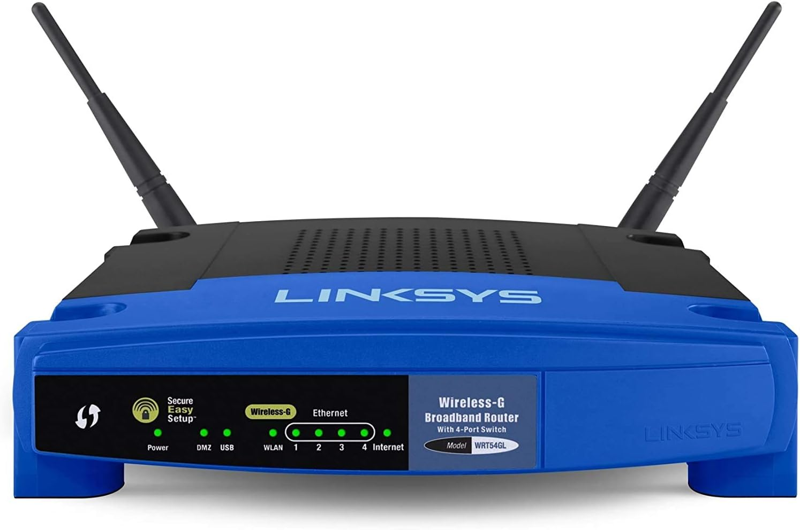
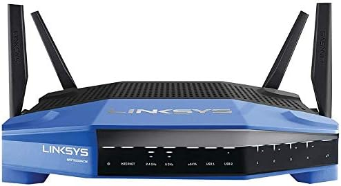

Growing up, I had no idea what a router even was. It was just this black box that *did the networking*. That’s all I knew. 

Our first router was one of those all-in-one units bundled with our ISP—**SBCGlobal** (acquired by AT&T). It was a locked-down piece of junk.

The first *real* router we bought as a family was the one I found recommended in *PC Magazine*—the legendary **Linksys WRT54G**. We used that thing for nearly a decade. It was rock solid.

It’s funny how companies often forget the products that made them great. The WRT54G was unmatched in its time. Years later, after college, my roommate and I found one in the trash and we rescued it. We modded one to run **OpenWRT** and It kept going for another three years until 2017, when it finally couldn’t keep up. Its single core processor a didn’t have the processing power to handle modern bandwidth demands—especially with the rise of smart devices and IoT.

Then came the **TP-Link Archer C7/C8/C9**. At launch, they were solid contenders. For their price, they outperformed rivals from Netgear, Linksys, and D-Link. Only ASUS came close. But the honeymoon didn’t last. Within five years, they were showing their age. Worse, TP-Link—thanks to what I can only describe as short-sighted engineering—locked the firmware down and made open-source support a nightmare. No OpenWRT, no Tomato, no fun. (DDwrt later became available)

And here’s the irony: **TP-Link is a Chinese company**, yet somehow they’ve created a product that goes *against* their own communist ideals—no community support, no sharing, and limited redistribution of firmware. You think they'd take their political ideollogy to heart and disrupt the market but I guess it's only communal when it’s convenient. So now, that once-promising router just sits in storage—exiled like a fallen comrade.

In the mid-2010s, Linksys tried to recapture the magic with the **WRT3200ACM**—a spiritual successor to the WRT54G. I picked one up during the pandemic, and it felt like the legend was back. And to be fair, it held its own for years. But now, five years later, it’s starting to show its limits again -- occasional issues with the 5ghz network band to start with. Still, not bad for a router that’s approaching its 10-year mark.

## 📡 Router Spec Breakdown

Here’s a side-by-side look at three routers that defined my home networking journey:

---

### 🔹 Linksys WRT54G  
*Legendary early-2000s router*

| Spec                          | Details                                         |
|-------------------------------|-------------------------------------------------|
| **Release Year**              | ~2002                                           |
| **Wi-Fi Standard**            | 802.11b/g (2.4GHz only)                         |
| **Wi-Fi Speed**               | Up to 54 Mbps                                   |
| **CPU**                       | Broadcom BCM5352 @ 200 MHz                      |
| **RAM**                       | 16 MB (early versions), 8 MB (later versions)   |
| **Flash Storage**             | 4 MB (2 MB on cost-reduced versions)           |
| **Ethernet Ports**            | 1 WAN + 4 LAN (10/100 Mbps)                     |
| **Antenna**                   | 2x external 2 dBi antennas                      |
| **Open-Source Firmware**      | Excellent (OpenWRT, DD-WRT, Tomato)             |
| **Notes**                     | Revered for hackability, especially v1–v4       |

---

### 🔹 TP-Link Archer C8  
*Affordable AC-era router that aged poorly*

| Spec                          | Details                                         |
|-------------------------------|-------------------------------------------------|
| **Release Year**              | ~2014                                           |
| **Wi-Fi Standard**            | 802.11ac (dual-band: 2.4GHz + 5GHz)            |
| **Wi-Fi Speed**               | AC1750 (450 Mbps + 1300 Mbps)                  |
| **CPU**                       | Broadcom BCM4708A0 @ 800 MHz (dual-core)       |
| **RAM**                       | 128 MB                                          |
| **Flash Storage**             | 16 MB                                           |
| **Ethernet Ports**            | 1 WAN + 4 LAN (Gigabit)                         |
| **USB Ports**                 | 1x USB 3.0, 1x USB 2.0                          |
| **Antenna**                   | 3x external antennas                           |
| **Open-Source Firmware**      | Poor (locked bootloader on most models)        |
| **Notes**                     | Great price-to-performance at launch, but locked-down firmware limits lifespan |

---

### 🔹 Linksys WRT3200ACM  
*The spiritual successor to the WRT54G*

| Spec                          | Details                                         |
|-------------------------------|-------------------------------------------------|
| **Release Year**              | 2016                                            |
| **Wi-Fi Standard**            | 802.11ac (dual-band, MU-MIMO support)          |
| **Wi-Fi Speed**               | AC3200 (600 Mbps + 2600 Mbps theoretical)      |
| **CPU**                       | Marvell Armada 88F6820 @ 1.8 GHz (dual-core)   |
| **RAM**                       | 512 MB DDR3                                     |
| **Flash Storage**             | 256 MB NAND                                     |
| **Ethernet Ports**            | 1 WAN + 4 LAN (Gigabit)                         |
| **USB Ports**                 | 1x USB 3.0, 1x combo eSATA/USB 2.0              |
| **Antenna**                   | 4x external high-performance antennas          |
| **Open-Source Firmware**      | Very good (OpenWRT supported with caveats)     |
| **Notes**                     | Marketed for open-source, but Marvell Wi-Fi driver issues caused long-term headaches |

### 🔹 ASUS RT‑AX5400  
*Modern dual-band Wi‑Fi 6 router with solid internals*

| Spec             | Details                                       |
|------------------|-----------------------------------------------|
| **Release Year** | 2023                                          |
| **Wi‑Fi Standard** | Wi‑Fi 6 (802.11ax), dual-band               |
| **Max Speed**    | AX5400 (574 Mbps + 4804 Mbps)                 |
| **CPU**          | Triple-core @ 1.5 GHz                         |
| **RAM**          | 512 MB                                        |
| **Flash**        | 256 MB                                        |
| **Ethernet**     | 1×2.5 GbE WAN + 4×1 GbE LAN                   |
| **USB Ports**    | 1x USB 3.2 Gen 1                              |
| **Firmware**     | AsusWRT (with AiProtection, AiMesh)           |
| **Notes**        | Strong value in the mid-tier; good performance, but closed firmware ecosystem |

---

## So, Where Are We in 2025?

Let’s look at the current state of consumer routers:

### 🔹 Asus RT‑BE58U

| Spec             | Details                                      |
|------------------|----------------------------------------------|
| **Release Year** | 2024                                          |
| **Wi‑Fi Standard** | Wi‑Fi 7 (802.11be), dual-band 2.4/5 GHz     |
| **Max Speed**    | ~3.6 Gbps (688 + 2882 Mbps) :contentReference[oaicite:1]{index=1} |
| **CPU**          | Quad‑core @ 2.0 GHz :contentReference[oaicite:2]{index=2} |
| **RAM**          | 1 GB :contentReference[oaicite:3]{index=3} |
| **Flash Storage**| 256 MB :contentReference[oaicite:4]{index=4} |

---

### 🔹 Netgear Nighthawk RS300

| Spec             | Details                                      |
|------------------|----------------------------------------------|
| **Release Year** | 2025                                          |
| **Wi‑Fi Standard** | Wi‑Fi 7, tri-band (2.4/5/6 GHz)             |
| **Max Speed**    | ~9.3 Gbps :contentReference[oaicite:5]{index=5} |
| **CPU**          | Quad‑core @ 2.0 GHz :contentReference[oaicite:6]{index=6} |
| **RAM**          | 2 GB :contentReference[oaicite:7]{index=7} |
| **Flash Storage**| 512 MB NAND :contentReference[oaicite:8]{index=8} |

---

### 🔹 Netgear Nighthawk Pro Gaming XR1000 (Wi‑Fi 6)

| Spec             | Details                                      |
|------------------|----------------------------------------------|
| **Release Year** | 2021                                          |
| **Wi‑Fi Standard** | Wi‑Fi 6 (802.11ax), AX5400                  |
| **Max Speed**    | ~5.4 Gbps (600 + 4800 Mbps) :contentReference[oaicite:9]{index=9} |
| **CPU**          | Triple‑core @ 1.5 GHz :contentReference[oaicite:10]{index=10} |
| **RAM / Flash**  | Not specified in official sources             |

---

### 🔹 TP-Link BE3600 (Archer BE3600)

| Spec             | Details                                      |
|------------------|----------------------------------------------|
| **Release Year** | 2024                                          |
| **Wi‑Fi Standard** | Wi‑Fi 7 (802.11be), dual-band             |
| **Max Speed**    | ~3.6 Gbps (688 + 2882 Mbps) :contentReference[oaicite:11]{index=11} |
| **CPU**          | Quad‑core @ ~2.0 GHz :contentReference[oaicite:12]{index=12} |
| **RAM**          | 2 GB DDR4 :contentReference[oaicite:13]{index=13} |
| **Flash Storage**| 256 MB :contentReference[oaicite:14]{index=14} |

---

### 🔹 TP-Link Archer AX55

| Spec             | Details                                      |
|------------------|----------------------------------------------|
| **Release Year** | 2022                                          |
| **Wi‑Fi Standard** | Wi‑Fi 6 (AX3000), dual-band               |
| **Max Speed**    | ~2.976 Gbps (574 + 2402 Mbps) :contentReference[oaicite:15]{index=15} |
| **CPU**          | Dual‑core @ 1.0 GHz (Qualcomm IPQ0518) :contentReference[oaicite:16]{index=16} |
| **RAM**          | 512 MB :contentReference[oaicite:17]{index=17} |
| **Flash Storage**| 128 MB :contentReference[oaicite:18]{index=18} |

---

### 🔹 Asus RT‑BE96U

| Spec             | Details                                      |
|------------------|----------------------------------------------|
| **Release Year** | 2024                                          |
| **Wi‑Fi Standard** | Wi‑Fi 7 (802.11be), tri-band 2.4/5/6 GHz   |
| **Max Speed**    | ~18.7 Gbps (1.4 + 5.8 + 11.5 Gbps) :contentReference[oaicite:19]{index=19} |
| **CPU**          | Quad‑core @ 2.6 GHz :contentReference[oaicite:20]{index=20} |
| **RAM**          | 2 GB DDR4 :contentReference[oaicite:21]{index=21} |
| **Flash Storage**| 256 MB :contentReference[oaicite:22]{index=22} |

---

### Entry-level (< $100)

> Still mostly plastic boxes with questionable firmware support, aging chipsets, and zero forward-thinking.

### Mid-tier ($100–$300)

> More capable, but UI/UX remains abysmal. Most still lack configuration backup or meaningful monitoring tools.

### High-end ($300+)

> You're mostly paying for mesh branding, flashy antennas, and bloated features you’ll never use.

Honestly? I’m not impressed.

It’s been nearly a quarter-century since the WRT54G debuted, and progress feels sluggish. At this rate, we won’t see routers with 16GB RAM and octa-core CPUs in consumer routers until **2050**.

Whats worse is the deceptive marketing. Some models may be noted as having a certain amoutn fo ram or certain type of processor but subdsequent revisions or alt version of it have differenet specs (usually less). You don't know what you're buying unless you look at the serial/sku which is honeslty impossible to determine wihtout opening the packaging and exmaining the unit. 

---

## The Real Problem: UI/UX and Lock-In

My biggest frustration? The locked-down UI/UX of most consumer routers.

I have specific network mappings, and the ability to export and save those configurations is essential. No one wants to manually rebuild IP/MAC address assignments every time something breaks or gets upgraded.

And yet, most manufacturers completely ignore this.

For example, **iXsystems** (the folks behind [TrueNAS](https://www.truenas.com)) lets you export and import full configurations—making migrations painless. My **TP-Link Archer C9** didn’t have this. Neither does my current **Linksys WRT3200ACM**.

---

## Enter Open Source: pfSense

You know who *does* get it? The open-source community. **pfSense.**

With pfSense, you get:

- Full config export/import
- Advanced firewall and VLAN controls
- Monitoring tools that actually work
- A community that documents everything 

---

## What’s Next for Me?

Thus, for my next project, I’m building a [pfSense](https://www.pfsense.org/) router—either from:

- A community-recommended office PC (like a **Lenovo ThinkCentre**), or  
- A small-form-factor ITX build using spare parts.

The era of locked-down consumer routers is over. It’s time to build something that actually works for *me*.

---

Stay tuned—I’ll be documenting the build process and config setup soon.

## State of The Routers

## What I Really Desire
- 2.5G ports (not this 1 2.5Gbe port 4 1gbe port bullshit)
- quad core 2ghz
- 1 GB RAM or more
- opensource capability
- ability to export and import configs

## What Companies Are Shoving Down My Throad
- Mesh routers/networking (i suspect this is because they can sell more products this...a lotof the mesh equipment only works with eqiupment of the same brand. it kind of reminds me of the situation that existed in the early 2000 when wireless networking was first introduced, a lot networking products worked much better with their own product lines -- i.e linkssy router with linksys wifi adapter)
- Wifi6e and Wifi7 (what does the 6e even mean). I am not even on wifi 6. I am not even sure i am on wiif 5 o 4. Why do they call it that?
- Tri-band and gaming marketing

## What I Will Build Instead
- 2x 2.5be ports
- Quad-core 7th or 8th gen Intel i5T or i7T
- 8 GB RAM
- pfsense (and the ability to export and import configs)

I'll use my existing Asus RT-AX5400 router as a access point since Pfsense does not do wifi too well on its own. Instead of building it entirely from scratch (which can increases costs to the $100...), I'll aim to find a respectable Lenovo Thinkcentre m920q -- highly recomended by the enthusasist community for what its capable of acheving under Pfesense. 

### 🔹 Custom pfSense Router (Lenovo ThinkCentre M920q Mod)

| Spec                   | Details                                                  |
|------------------------|----------------------------------------------------------|
| **Built Year**         | 2025                                                     |
| **Wi-Fi Standard**     | N/A (wired-only)                                         |
| **Wi-Fi Speed**        | N/A                                                      |
| **CPU**                | Intel Core i5‑8500T @ 2.1 GHz (6-core)                   |
| **RAM**                | 8 GB DDR4                                                |
| **Flash Storage**      | 256 GB NVMe SSD                                          |
| **Ethernet Ports**     | 1×1 GbE WAN + 2×2.5 GbE LAN (modded)                     |
| **USB Ports**          | Multiple (USB 3.0 and 2.0)                               |
| **Antenna**            | N/A                                                      |
| **Firmware**           | pfSense                                                  |
| **Notes**              | Everything I wanted that Linksys refused to give me.     |

The ironic part is that many of these Chinese manufacturers are now selling low-end, barebones mini-PCs marketed as "pfSense-ready" appliances. But reviewers often report that these devices don’t last more than a couple of years. I strongly suspect they all suffer from the same underlying flaw: inadequate passive cooling.

Not a single one of these boxes seems to include even a basic cooling fan. Whether this omission is a cost-cutting measure or simply poor design (or both), it’s baffling—especially for devices expected to run 24/7 in a network infrastructure role.

So instead of relying on these prebuilt units, I’ve decided to go my own way and build a system that actually meets my standards—starting with proper airflow and thermal management. Understandbly, the small form factor of the Lenovo ThinkCentre M920q is limiiting itself in terms of airflow. But I think its better than passive cooling. 